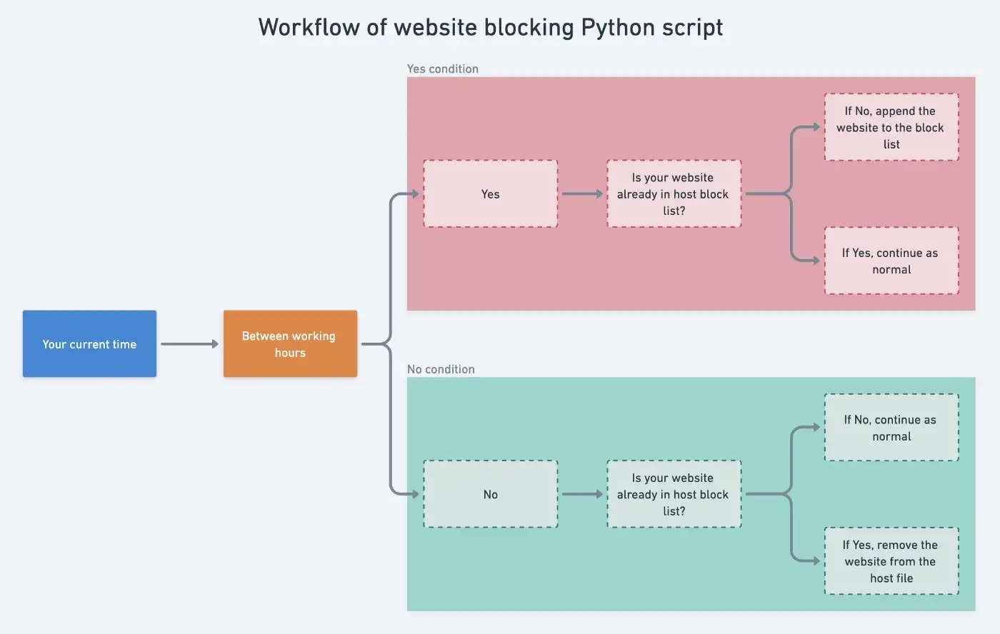

# Website Blocker with Python

Block all distressing websites using a Python script. If you want to read about this as a
blog, [see here](https://medium.com/artificialis/how-to-make-website-blocker-with-python-c4d606ca6257).

## Description

If you are boring to use website-blocking apps or just want to use your own thing, you can create a website-blocking app
yourself with Python.

## Requirement

* Just Python (we will only use `datetime` module)

## How to set up

* Fork this repo or download as a zip
* Add some more websites in `websitelist` in `bocklist` file
    * If you are using Windows, you must have to change your `hostpath` file path
* Change the starting time and ending time
    * If you want, you can even more add some time intervals (if you are familiar with Python)
* If your current time is between working time, you will print `Time to focus ...` and
  otherwise `Enjoy your free time ...`.

## How to use

It will need to run when you want to block and need to run again if the working time is over. Yes, it is a little
tricky. And you also should control your mind to block. It is just a tool that can stop you from procrastinating.

Let’s crap to use:

* If you want to start to block, run the file
* If you are free from working hours and want to stop, run the file again (this will unblock all the websites)

Let’s see the workflow of that script behind the sense.

If you want to see the interactive
mode, [see here](https://whimsical.com/website-blocker-workflow-GfQ8QfybHG3ZnPnEgGiPFs)

If you have any problems and want to contact me, [email me](mailto:iukt@tuta.io).

